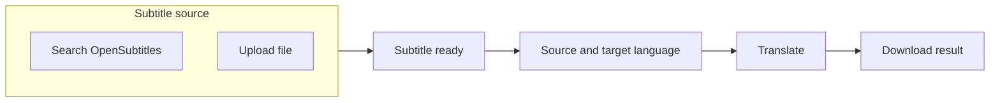

# OpenSubtitles search + upload fallback

## Current baseline

- Translation is a single POST to `[/api/translate](../../srt_translator/api/__init__.py)`: multipart `srtFile`, `sourceLanguage`, `targetLanguage`, `dualLanguage`, `taskId`. The handler always requires `request.files['srtFile']` and parses content through the existing pipeline.
- Frontend: `[index.html](../../index.html)` + `[static/js/main.js](../../static/js/main.js)` — file picker is `required`; progress uses SSE + same translate POST.

## OpenSubtitles.com (API v1) — what you are signing up for

- **Auth**: Register at [OpenSubtitles.com](https://www.opensubtitles.com/), create an **API key**, and use **login** (`POST /login` with JSON username/password) to obtain a **JWT** and optional `base_url` (docs: [ai.opensubtitles.com/docs](https://ai.opensubtitles.com/docs)). Subsequent search/download calls use `Api-Key`, `User-Agent` (`YourApp v1.0`), and `Authorization: Bearer <token>` where required.
- **Limits**: Downloads are quota-based (`allowed_downloads` / `remaining_downloads`); rate limits and `429` handling matter. Keys and passwords must live **only on the server** (new env vars, e.g. `OPENSUBTITLES_API_KEY`, `OPENSUBTITLES_USERNAME`, `OPENSUBTITLES_PASSWORD`), never in the browser.
- **Language codes**: OS uses codes like `zh-cn`, `pt-br` — align or map from your existing dropdown values in `[index.html](../../index.html)` where they differ from Google’s (`pt` vs `pt-pt`, etc.).

Implementation sketch (backend):

- New small module, e.g. `[srt_translator/services/opensubtitles_client.py](../../srt_translator/services/opensubtitles_client.py)`: login (with token cache + refresh on 401), `search_subtitles(query, languages, …)`, `request_download(file_id)`, fetch subtitle bytes (often gzip — decompress before parsing).
- New JSON routes on the existing [api blueprint](../../srt_translator/api/__init__.py), for example:
  - `POST /api/opensubtitles/search` — body: `{ "query": "...", "languages": "en,es" }` (and optional TV fields if you add them later).
  - `POST /api/opensubtitles/fetch` — body: `{ "file_id": "..." }` — server downloads the file, stores it **temporarily** (same pattern as translated output: temp dir + UUID), returns `{ "fetchedId": "<uuid>", "filename": "...", "format": "srt" }`.
- Extend `**/api/translate`** to accept **either**:
  - `srtFile` (current behavior), **or**
  - `fetchedId` (server looks up temp file / bytes, validates extension, then runs the **same** parse → translate → temp download path).

This keeps one translation pipeline and avoids sending large subtitle bodies through the browser.

## How the new UI/UX would manifest

Recommended pattern: **one screen, explicit source choice**, then shared “languages + translate.”

1. **Top of the form**: segmented control or two radio options — **“Search subtitles”** | **“Upload file”**.
2. **Search path** (visible when selected):
  - Text field: movie/show **title** (and later optional IMDb id, season/episode if you want TV precision).
  - **Subtitle language** for the search (often the same as “Original language” — you can auto-sync or keep one dropdown).
  - **Search** button → see **Search results (below)** — **Select** on one row sets internal state to the chosen `file_id` and calls `fetch` to obtain `fetchedId`.
  - Show a short **success line**: e.g. “Using: `Movie.Name.en.srt`” with **Change** to pick another result.
3. **Upload path** (visible when selected): keep the current drag-and-drop; remove the HTML `required` on the file input and enforce in JS: submit allowed if **either** file chosen **or** `fetchedId` present.
4. **Translate** button: same label and SSE flow; `[main.js](../../static/js/main.js)` builds `FormData` with file **or** `fetchedId` (and still `taskId`, languages, dual checkbox).

### Search results: content, layout, and many languages

OpenSubtitles search returns a **flat list** of subtitle *files*; the same title can appear as many rows (languages, releases, FPS variants, HI/sdh, machine-translated, etc.). The UI should make **pick one file** fast without a wall of identical-looking text.

**What each row should convey** (map from API fields where available):

- **Title / release context**: parent work name, **year** (if movie), **S×E** or episode title (if TV), and a short **release** hint (e.g. BluRay / WEB / 1080p) so users can match their rip.
- **Language**: human-readable name + code (e.g. `English · en`) — this is the subtitle track language, not the movie’s audio.
- **File / format**: **extension or format** (SRT, ASS, SUB), and **filename** or upload name (truncated with full title on hover).
- **Quality / trust signals** (show only if the API returns them): download count, rating/score, uploader; flags such as **hearing impaired**, **machine translated**, **verified** (if present).
- **Technical hints** (when present): **FPS**, **frame rate** or duration alignment notes — helps users whose subs drift.

**Neat patterns when there are dozens of languages and files**

1. **Server-side or client-side filter by language first** — Reuse the user’s “subtitle language” from the search bar as the default filter so the first paint shows **only** that language (or “Any” to see everything). Offer a compact **language filter**: dropdown or horizontal **chips** with **counts** (`English (24)`, `Spanish (18)`), derived by grouping results.
2. **Group, then list** — After optional release disambiguation (see below), group rows by **language**, then sort inside each group by a sensible default (e.g. downloads desc, or non–machine-translated first). Render as **accordions**: one panel per language, **expanded** for the filter language and **collapsed** for others — avoids a 200-row table.
3. **Single sortable table** (simpler v1) — One table with columns: Language | Release / filename | Format | Flags | Downloads (or score) | **Select**. Add a **language** column filter and client-side **sort**; cap initial rows with **“Show more”** or paginate if the API returns pages.
4. **Two-step disambiguation** (optional, if the API returns a stable parent id): Step A — pick **which movie/show episode** (cards or short list: poster + title + year + episode). Step B — show only subtitles for that parent, then apply the grouping/filtering above. Reduces noise when the query matches many franchises or remakes.

**Interaction details**

- **Select** is one click per row (or radio + “Use this subtitle”); show a **loading** state on the row while `fetch` runs.
- Preserve **scroll position** or collapse results after selection so the user still sees the success line and language controls.
- Empty filtered state: *“No subtitles in this language — try ‘Any’ or another language.”*

Empty states and errors:

- Search returns nothing → message: **“No subtitles found — try another query or switch to Upload.”**
- API misconfigured (missing env) → clear server error: “OpenSubtitles is not configured on this server.”
- Quota / 429 → user-facing message to retry later or use upload.

Accessibility: preserve a single logical form, associate labels with inputs, and announce loading for search results.

## Better or different approaches (tradeoffs)

| Approach                                        | Pros                                                  | Cons                                                       |
| ----------------------------------------------- | ----------------------------------------------------- | ---------------------------------------------------------- |
| **OpenSubtitles text search (planned)**         | Large catalog, official API, fits “search movie name” | Account, API key, quotas, login complexity                 |
| **Hash-based search (user selects video file)** | Very accurate sync to release                         | Users must have the video file; different UX; still OS API |
| **TMDB/OMDb + IMDb id into OS**                 | Cleaner disambiguation (“which Inception?”)           | Extra API key(s) and a second integration step             |
| **Only upload (status quo)**                    | No third-party deps                                   | Manual work for users                                      |

A practical upgrade after v1: combine **title search** with optional **IMDb ID** field (user pastes from IMDb) for fewer wrong matches, without building a full TMDB UI.

## Testing and config

- Add tests with **mocked** HTTP responses for search + download (no real credentials in CI), similar to `[tests/test_translate_and_download.py](c:/Users/ryanm/OneDrive/Documents/projects/subtitle-translator/tests/test_translate_and_download.py)`.
- Document required env vars in README or `.env.example` (only if you already maintain one — otherwise a short comment in `[config.py](c:/Users/ryanm/OneDrive/Documents/projects/subtitle-translator/srt_translator/config.py)` is enough per your preference).

## Search results table design (approved)

User confirmed the **mockup** as the target layout for rows that include movie posters:

- **First column (“Title / release”)**: horizontal row with a **small portrait poster** (~48×72, rounded) on the **left**; **title / year / episode** and muted **release / filename** lines on the **right** (`.os-title-cell`, `.os-poster-thumb`, `.os-title-cell-text`).
- **No poster URL**: show a **gray placeholder** block matching thumb size (`.os-poster-placeholder`) so alignment stays consistent.
- **Other columns**: Language, Info, Select — unchanged relative to a standard results table.

Implementation in the app should match this; if thumbnails are blank, treat as **data** (`posterUrl`) or **poster-image proxy** behavior, not a different layout.

## Summary

- **UX**: Radio/tabs for **Search vs Upload** → search UI + results → **one** “subtitle ready” state → existing language + translate + download flow.
- **Backend**: Proxy OpenSubtitles on the server; add search + fetch endpoints; generalize `/api/translate` to accept `fetchedId` or file.
- **Alternatives**: IMDb-assisted search and video-hash search are the main upgrades if you want higher match quality without abandoning OpenSubtitles.

