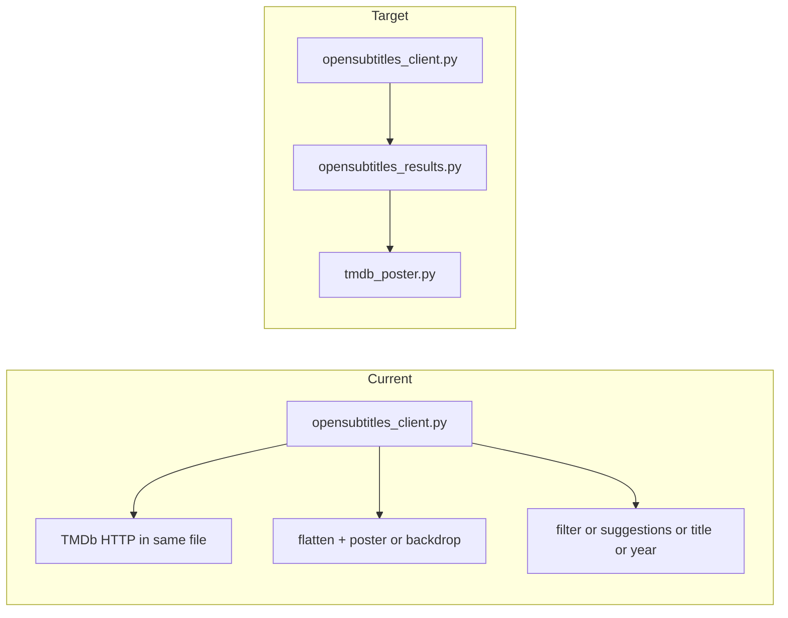

# Refactor plan: smaller modules, lower complexity, same behavior

## Cross-cutting goals (helpers, complexity, redundancy, unused)

These apply **in every phase**, not only when splitting files:

- **Helper extraction:** Pull nested logic and repeated conditionals into **small, named functions** (pure where possible) so the main flow reads as steps, not a deep tree. Applies to [`translate_srt`](srt_translator/api/__init__.py), [`flatten_subtitle_results`](srt_translator/services/opensubtitles_client.py) / related normalization, [`opensubtitles_routes.py`](srt_translator/api/opensubtitles_routes.py), and [`main.js`](static/js/main.js).
- **Cyclomatic complexity:** Primary levers are **fewer branches per function** (helpers, lookup tables/dicts instead of long `if/elif` chains where clear), **early returns**, and **one level of concern per function** (e.g. “decode file” vs “run SRT translate” vs “build JSON response”). Optionally run **`radon cc`** (or IDE complexity hints) on files before/after refactors; treat as a guide—do not chase numbers at the cost of obscure indirection.
- **Redundancy:** After extraction, look for **copy-paste** between `srt` / `ass` / `sub` paths (batching, progress updates, pinyin/dual string assembly) and consolidate into shared helpers **only where** inputs/outputs are truly the same shape—tests must prove no drift.
- **Unused code:** Remove **unreferenced functions**, **orphan imports**, **debug-only blocks** (e.g. NDJSON agent log), and **commented-out dead routes** once confirmed unused. Use **vulture** / **ruff** plus grep; do not delete symbols referenced from templates, `index.html`, or e2e selectors without checking.

## Current state (since the original plan)

Some backend logic has **already** been pulled out of the monolith:

- [`fetched_subtitle_file.py`](srt_translator/services/fetched_subtitle_file.py) — fetched-id validation and temp path resolution (used by [`api/__init__.py`](srt_translator/api/__init__.py))
- [`ass_markup.py`](srt_translator/services/ass_markup.py) — ASS escaping / plain-text extraction for translation (used by translate route)
- [`subtitle_preview.py`](srt_translator/services/subtitle_preview.py) — preview-related service code
- [`tests/test_ass_markup.py`](tests/test_ass_markup.py) — unit tests for ASS markup

**Largest files now (approximate line counts):**

| Area | File | Notes |
|------|------|--------|
| OpenSubtitles + search normalization | [`opensubtitles_client.py`](srt_translator/services/opensubtitles_client.py) | ~1250+ lines; HTTP client **and** flatten/TMDb/title-year/filter/work-suggestions |
| API blueprint | [`api/__init__.py`](srt_translator/api/__init__.py) | ~620 lines; translate still dominates |
| OpenSubtitles routes | [`opensubtitles_routes.py`](srt_translator/api/opensubtitles_routes.py) | ~340 lines; poster proxy + search API |
| Frontend | [`static/js/main.js`](static/js/main.js) | ~1380 lines |
| Unit tests | [`tests/test_opensubtitles.py`](tests/test_opensubtitles.py) | ~1230 lines |

**Browser e2e (new):** [`e2e/`](e2e/) with Playwright — search/select/translate/download and related journeys; CI in [`.github/workflows/e2e.yml`](.github/workflows/e2e.yml) (`pytest e2e -q --browser chromium`). Any API contract or DOM-facing refactor should pass **both** `pytest tests` and `pytest e2e`.

---

## TMDb vs OpenSubtitles (your question — updated)

**Yes — TMDb API logic still lives inside [`opensubtitles_client.py`](srt_translator/services/opensubtitles_client.py).** It has grown beyond “poster only”:

- `_tmdb_fetch_images_payload` — `https://api.themoviedb.org/3/{movie|tv}/{tid}/images`
- `_tmdb_first_poster_from_images_payload` and `_tmdb_first_backdrop_from_images_payload`
- `_tmdb_poster_and_backdrop_for_id` — replaces the earlier poster-only helper; uses `TMDB_API_KEY`, tries movie then tv, caches by id
- Resolution is folded into `_resolve_poster_and_backdrop` and then `flatten_subtitle_results` (rows may carry poster **and** backdrop metadata)

Extraction target: e.g. [`srt_translator/services/tmdb_poster.py`](srt_translator/services/tmdb_poster.py) (name could be `tmdb_images.py` if you want poster+backdrop explicit) with the same public behavior as today. Keep `urllib.request.urlopen` so tests that patch `urllib.request.urlopen` keep working.

**Avoid import cycles:** `tmdb_poster.py` must not import `opensubtitles_client.py`. Resolve user-agent duplication vs [`config.py`](srt_translator/config.py) as before.

---

## Phase 1 — OpenSubtitles stack (highest impact)

**1a. Add `tmdb_poster.py` (or `tmdb_images.py`)**  
Move all `_tmdb_*` functions and TMDb-only HTTP/parsing. Preserve poster **and** backdrop behavior and cache semantics. Keep each public-facing function **single-purpose** (fetch vs parse vs resolve-with-cache) to keep McCabe low.

**1b. Add `opensubtitles_results.py` (name flexible)**  
Move everything that is **not** the HTTP client: from roughly `_safe_download_count` through `total_count_from_response`, including:

- Poster/backdrop URL helpers, JSON:API `included` indexing, `_resolve_poster_and_backdrop`, `flatten_subtitle_results`, pagination helpers

Where `flatten_subtitle_results` or `_poster_from_related_links_block` still read as “many branches,” **extract** sub-helpers (e.g. “try keys in order,” “walk JSON:API relationship”) so each function has one obvious job.

**1c. Optional second module if one file is still huge**  
[`opensubtitles_client.py`](srt_translator/services/opensubtitles_client.py) also contains search/work UX helpers (e.g. `filter_subtitle_rows_by_query`, `distinct_work_suggestions_from_subtitles`, title/year heuristics, `normalize_opensubtitles_imdb_id`). If `opensubtitles_results.py` exceeds a comfortable size (~400–500 lines), split into e.g. `opensubtitles_search_normalize.py` for filter/suggestion/query/title-year logic, imported by routes and tests as needed.

**1d. Slim `opensubtitles_client.py` to:**  
`OpenSubtitlesClient` (login, search, download), language cache + `get_language_name_lookup` / `reset_subtitle_language_names_cache` / `_parse_language_infos_payload`, exceptions, `_https_base`, and any small helpers truly tied to HTTP only.

**1e. Stable imports**  
Re-export `flatten_subtitle_results`, `total_pages_from_response`, `total_count_from_response`, and any other names imported from `opensubtitles_client` in [`opensubtitles_routes.py`](srt_translator/api/opensubtitles_routes.py) / tests **or** update all call sites to import from the new module(s). Pick one style consistently.

**Verification:** `pytest tests/test_opensubtitles.py -q` and `pytest e2e -q --browser chromium` (e2e mocks upstream but exercises flatten-driven UI).

---

## Phase 2 — API blueprint ([`api/__init__.py`](srt_translator/api/__init__.py), ~620 lines)

**2a. Extract translate pipeline**  
`translate_srt` remains the main cyclomatic hotspot (formats `srt` / `ass` / `sub` × pinyin × dual, now with ASS markup helpers). Move implementation to e.g. [`srt_translator/api/translate_routes.py`](srt_translator/api/translate_routes.py):

- **Thin** route handler: validate request, build a small context dict/tuple, **delegate** to `translate_subtitle_payload(...)` (or similarly named) that dispatches by format
- **Per-format translators** as separate functions (`_translate_srt_job`, `_translate_ass_job`, `_translate_sub_job`) or a small registry map to avoid one giant `if/elif` chain
- **Shared pieces** extracted once: decode loop, `update_progress` wiring, “write temp file + build JSON response,” batch async translate loops used identically by ASS and SUB
- **Do not** duplicate logic that already lives in `fetched_subtitle_file`, `ass_markup`, `subtitle_preview`

**2b. Debug / dead code cleanup (behavior-neutral)**  
- [`download_file`](srt_translator/api/__init__.py): remove `logger.info("test")`, `print(...)`, and stray `# ...existing code...` if still present  
- **`_dbg_ass_ndjson` / `# #region agent log`:** writes NDJSON under a fixed path — treat as **candidate for removal** or guard behind `if os.environ.get("DEBUG_ASS_NDJSON")` (or similar) so production and CI never touch the filesystem unless intended  
- Remove commented-out duplicate health route block if still present

**Verification:** `pytest tests/test_translate_and_download.py`, `tests/test_errors.py`, OpenSubtitles fetch tests, and **`pytest e2e -q --browser chromium`**.

---

## Phase 3 — Frontend ([`static/js/main.js`](static/js/main.js), ~1380 lines)

**Optional but strongly aligned with “large files”:** split into ES modules under `static/js/`, single entry `` in [`index.html`](index.html). Preserve DOM IDs and API paths used by Playwright (e.g. `#sourceSearch`, “Movie or show title”, “Search subtitles”).

**Within each module:** extract **pure helpers** (parse API JSON, build row markup, pager state) and keep event handlers **thin** (call helpers, minimal nesting) to reduce cognitive load and duplicate fetch/error handling.

**Verification:** `pytest e2e -q --browser chromium` plus quick manual smoke if needed.

---

## Phase 4 — Unused code, redundancy sweep, test file weight

- Run **vulture** / **ruff** on `srt_translator/` and `tests/`; confirm each removal (templates, dynamic imports, e2e selectors).  
- **Redundancy:** after Phase 2, grep for duplicated strings/logic between format branches; consolidate only with tests proving identical behavior.  
- After service splits, if [`tests/test_opensubtitles.py`](tests/test_opensubtitles.py) is still hard to navigate, split into focused modules (e.g. `test_opensubtitles_flatten.py`, `test_opensubtitles_routes.py`) **without** changing assertions — pure file organization.

---

## Order of work and risk

| Phase | Risk | Mitigation |
| ----- | ---- | ---------- |
| 1 TMDb + results (+ optional search module) | Medium | Same public functions; full `test_opensubtitles`; e2e; spot-check cc on new modules |
| 2 translate extract + helpers + debug cleanup | Medium–high | Full pytest + e2e; shared helpers covered by same tests |
| 3 JS modules + thin handlers | Low–medium | e2e covers main journeys |
| 4 vulture + redundancy + optional test split | Low | Manual review each symbol / import; no silent behavior drift |

---

## What “same behavior” means in practice

- No changes to env vars (`TMDB_API_KEY`, OpenSubtitles vars), URL shapes, response JSON fields, or poster proxy allowlist in [`opensubtitles_routes.py`](srt_translator/api/opensubtitles_routes.py) unless fixing an undisputed bug (out of scope).  
- Refactors are **move + extract helpers + private renames**; avoid feature tweaks in the same pass.  
- **Regression bar:** `pytest tests` **and** `pytest e2e -q --browser chromium` (match CI).  
- **Complexity bar (soft):** no new “god” functions; largest remaining routines should be mostly orchestration calling small helpers.
