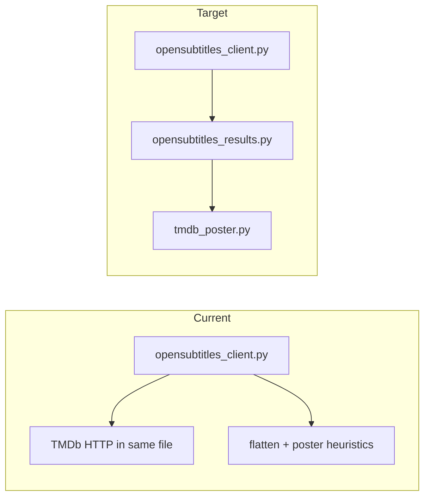

# Refactor plan: smaller modules, same behavior

## TMDb vs OpenSubtitles (your question)

**Yes — TMDb API logic is embedded in the OpenSubtitles client file today.** It is not OpenSubtitles-specific except as a fallback when flattening search rows:

- `[_tmdb_fetch_images_payload](srt_translator/services/opensubtitles_client.py)` calls `https://api.themoviedb.org/3/{movie|tv}/{tid}/images`
- `[_tmdb_poster_url_for_id](srt_translator/services/opensubtitles_client.py)` reads `TMDB_API_KEY`, tries `movie` then `tv`, caches by id
- `[flatten_subtitle_results](srt_translator/services/opensubtitles_client.py)` calls `_tmdb_poster_url_for_id` only after OS-side poster resolution fails

That belongs in its own module (e.g. `[srt_translator/services/tmdb_poster.py](srt_translator/services/tmdb_poster.py)`) with a narrow public API such as `poster_url_for_tmdb_id(tmdb_raw, cache: dict[int, Optional[str]]) -> Optional[str]` (same signature semantics as today). Keep using `urllib.request.urlopen` so existing tests that patch `[urllib.request.urlopen](tests/test_opensubtitles.py)` keep working.

**Avoid import cycles:** `tmdb_poster.py` must not import `opensubtitles_client.py`. Today TMDb requests reuse `DEFAULT_USER_AGENT` from the OS module; after extraction, duplicate the same env-based default string in `tmdb_poster.py` (or move a one-line shared constant into `[config.py](srt_translator/config.py)` if you prefer a single source).

---

## Phase 1 — OpenSubtitles stack (highest impact)

**1a. Add `[tmdb_poster.py](srt_translator/services/tmdb_poster.py)`**  
Move the three `_tmdb_*` functions and any TMDb-only imports. Unit tests that go through `flatten_subtitle_results` should still pass unchanged.

**1b. Add `[opensubtitles_results.py](srt_translator/services/opensubtitles_results.py)`** (name can vary; keep it descriptive)  
Move everything from roughly `_safe_download_count` through `total_count_from_response` (poster URL helpers, JSON:API indexing, `flatten_subtitle_results`, pagination helpers) out of `[opensubtitles_client.py](srt_translator/services/opensubtitles_client.py)`. That file should retain:

- `OpenSubtitlesClient` class (login, search, download)
- Language name cache + `get_language_name_lookup` / `reset_subtitle_language_names_cache` / `_parse_language_infos_payload`
- Exceptions and `_https_base`

**1c. Stable imports**  
Either:

- **Re-export** `flatten_subtitle_results`, `total_pages_from_response`, `total_count_from_response` from `opensubtitles_client.py` for backward compatibility, **or**
- Update `[opensubtitles_routes.py](srt_translator/api/opensubtitles_routes.py)` and `[tests/test_opensubtitles.py](tests/test_opensubtitles.py)` to import from `opensubtitles_results` directly.

Re-exports minimize diff noise in tests/routes; direct imports make dependencies explicit. Pick one style and apply consistently.

**Verification:** `pytest tests/test_opensubtitles.py -q`

---

## Phase 2 — API blueprint (`[api/__init__.py](srt_translator/api/__init__.py)`, ~477 lines)

**2a. Extract translate pipeline**  
`translate_srt` (~lines 88–386) is the main cyclomatic hotspot (formats `srt` / `ass` / `sub` × pinyin × dual). Move implementation into a dedicated module, e.g. `[srt_translator/api/translate_routes.py](srt_translator/api/translate_routes.py)`, with:

- Thin `translate_srt()` on the blueprint that validates request and delegates
- Private helpers for shared pieces (e.g. decode loop, progress callback wiring, per-format branches) so each function stays small and testable without changing HTTP contract

Keep `translation_progress`, `api_bp`, and small routes (`health`, `languages`, `task`) where they are **or** move all route functions into `translate_routes.py` and only register the blueprint in `__init__.py`—either pattern is fine if imports stay clear.

**2b. Remove obvious dead / debug code (behavior-neutral cleanup)**  

- `[download_file](srt_translator/api/__init__.py)`: remove `logger.info("test")` and the `print(...)` (lines ~399–409 area); keep real logging if useful  
- Remove the stray `# ...existing code...` and commented-out duplicate health route block if still present (lines ~39–43)

**Verification:** `pytest` (especially `[tests/test_translate_and_download.py](tests/test_translate_and_download.py)`, `[tests/test_errors.py](tests/test_errors.py)`, OpenSubtitles translate-with-fetch test)

---

## Phase 3 — Frontend (`[static/js/main.js](static/js/main.js)`, ~807 lines)

**Optional but aligned with “large files”:** split into ES modules under `static/js/` (e.g. `api-base.js`, `file-upload.js`, `opensubtitles-search.js`, `translate-form.js`) and use a single entry loaded from `[index.html](index.html)` via ``. Submodules `export` functions / attach listeners in an `init()` called from `main.js`.

**Constraints:** same global DOM IDs and fetch URLs; no bundler required if the app continues to serve static files from Flask as today.

**Verification:** manual smoke (search, translate, download) or any UI tests you add later.

---

## Phase 4 — Unused code (systematic)

- Run **[vulture](https://github.com/jendrikseipp/vulture)** (or **ruff** with appropriate rules if configured) on `srt_translator/` and `tests/`; treat each hit as “confirm before delete” so you do not remove names used only in templates or dynamic imports.
- Grep for **commented-out route blocks** and **unused imports** in touched files while refactoring.

Do **not** delete code that is only referenced from `index.html` or inline handlers without confirming.

---

## Order of work and risk

| Phase                  | Risk        | Mitigation                                       |
| ---------------------- | ----------- | ------------------------------------------------ |
| 1 TMDb + results split | Medium      | Same public functions; full `test_opensubtitles` |
| 2 translate extract    | Medium–high | Same request/response JSON; full pytest          |
| 3 JS modules           | Low–medium  | Manual UI pass                                   |
| 4 vulture              | Low         | Manual review each symbol                        |

---

## What “same behavior” means in practice

- No changes to env vars (`TMDB_API_KEY`, OpenSubtitles vars), URL shapes, response JSON fields, or poster proxy allowlist in `[opensubtitles_routes.py](srt_translator/api/opensubtitles_routes.py)` unless fixing an undisputed bug (out of scope here).
- Refactors are **move + rename-private-only**; avoid “while we’re here” feature tweaks.

