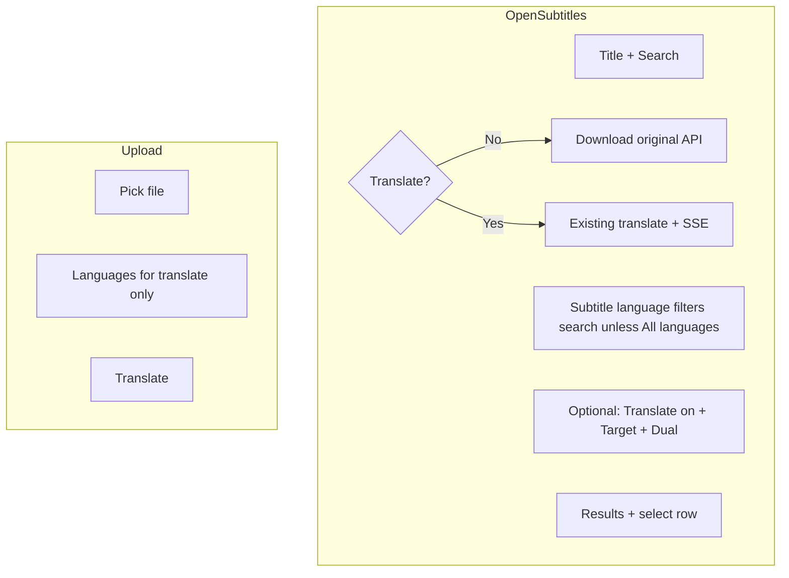

# Subtitle UI simplification and “original only” path

## What you already have (important)

- **Search language filter**: When “Search all languages” is **off**, `[runOpenSubtitlesSearch](static/js/main.js)` sets `osLastSearchLang` from `sourceLanguage.value` and the API maps that to OpenSubtitles codes (`[ui_lang_to_opensubtitles](srt_translator/services/opensubtitles_lang.py)`). So “Original language” already drives search when not searching all languages.
- **Auto original language after row pick**: On successful fetch, `[selectSubtitleFile](static/js/main.js)` calls `applySourceFromOpenSubtitlesRow(row.language)`, which maps OS codes to your `#sourceLanguage` options. So the “search all languages → select row → original updates” idea is **already implemented**.

The main gaps are **layout** (languages feel far from search), **wording** (everything reads as “translate”), and **no server path to download the fetched file without translation** (`[/api/translate](srt_translator/api/__init__.py)` always requires `sourceLanguage` ≠ `targetLanguage` and always runs translation).

---

## UX opinion (concise)

- **“Get Subtitles” as a single label for both download and translate** is ambiguous: users may think one click should finish the job. The plan uses **one primary button** whose behavior follows a **“Translate to another language”** checkbox (Option A): checked = translate flow; unchecked (search only) = download original.
- **Original-only** matters most for **OpenSubtitles**: after fetch, the file lives on the server as a temp file keyed by `fetchedId`; users should not be forced through Google Translate to get it. **Upload** users already have the file locally—hide or disable “original only” there to avoid a no-op.
- **Fake movie frame with subtitles** is strong for trust and timing preview: you already show poster thumbnails in results (`[titleCellWithPoster](static/js/main.js)` + `[/api/opensubtitles/poster-image](srt_translator/api/opensubtitles_routes.py)`). A **phase-2** “preview” panel could reuse the **selected row’s poster** (or a generic 16:9 frame) and overlay 1–2 sample cues (first parsed lines client-side after a lightweight `GET` of the original text, or a tiny `preview` JSON endpoint). Treat this as **polish**, not required for clarity.

---

## Recommended information architecture

---

## Implementation plan

### 1. Rename and clarify the main action

- Primary button label should reflect **translate checkbox** state: e.g. **Get subtitles** when downloading original, and **Translate subtitles** (or **Get subtitles** + confirm text clarifies translate) when translating—pick one consistent pair and update everywhere including `[main.js](static/js/main.js)` `finally` (~line 780) and any dynamic `btnText` updates.
- **Translate confirm dialog**: only show when checkbox is checked (translate path); download-original skips the modal or uses a minimal confirmation if desired.

### 2. “Original only” (OpenSubtitles) — backend

- Add a small endpoint in `[opensubtitles_routes.py](srt_translator/api/opensubtitles_routes.py)` (or adjacent module) e.g. `**GET /api/opensubtitles/fetched/<uuid>/download`** (or `POST` with JSON `{ "fetchedId": "..." }` if you prefer not to put UUID in the path):
  - Reuse the same UUID + tempdir resolution logic as `[translate_srt](srt_translator/api/__init__.py)` (lines ~124–133): validate format, locate `fetched_id_*` file, stream with `Content-Disposition` using the stored filename.
  - **Do not delete** the temp file on this route (so the user can still translate afterward with the same `fetchedId` until `/translate` removes it, matching current behavior after translation).
- Add a focused test in `[tests/test_opensubtitles.py](tests/test_opensubtitles.py)` (or new file) mirroring existing fetch/search tests: create a fake temp file, call the new route, assert status and body.

### 3. “Original only” — frontend

- In `[main.js](static/js/main.js)`, when **search mode** and **“Translate to another language”** is **unchecked**:
  - Call the new download URL (with `API` base), trigger browser download (blob or `window.location` depending on CORS/auth).
  - Optional: show a short success state without clearing the whole search UI (unlike `runTranslation`, which clears OpenSubtitles state after success ~lines 742–751)—product choice; clearing may frustrate users who want translate next.
- When **upload mode**: do not offer download-original (or show disabled control with hint “You already have this file”).

### 4. Translate toggle (Option A — locked in)

- Add a checkbox **“Translate to another language”** (default **checked** for backward compatibility).
- **Checked**: show `#targetLanguage` and `#dualLanguage`; primary button runs the existing translate flow (confirm dialog + SSE + `/api/translate`).
- **Unchecked** (OpenSubtitles only): hide `#targetLanguage` and `#dualLanguage`; primary button triggers **download original** via the new fetched-file endpoint (no translation, no source/target equality validation).
- **Upload mode**: checkbox **hidden or forced on**—upload path always translates (user already has the file locally). If the checkbox is hidden, treat translate as always enabled for validation and button behavior.
- Wire `change` on the checkbox to toggle visibility of the translate-only controls and to update primary button label (e.g. **Get subtitles** vs **Translate…** / **Download original** as appropriate—exact strings in section 1).

### 5. Move language controls next to search (layout)

- Refactor `[index.html](index.html)` so the **language block** is a single container (e.g. `#languageSection`) containing:
  - `#sourceLanguage` with helper text: **“Used to filter OpenSubtitles search (when not searching all languages).”**
  - **“Translate to another language”** checkbox, then translate-only subtree: `#targetLanguage`, `#dualLanguage` (shown only when checked).
- In `[main.js](static/js/main.js)` `syncSubtitleSourcePanels` (~lines 116–129), **re-parent** `#languageSection`:
  - **Search mode**: insert it **after** the “Search all languages” checkbox and **before** `#osSearchStatus` / results (matches “below search, above results”).
  - **Upload mode**: append it under the file picker area so upload users still see languages for translation.
- Update `[static/css/styles.css](static/css/styles.css)` for a compact row (e.g. flex/grid) so Original + Target do not dominate mobile layout.

### 6. Copy and success UI

- `[downloadSection](index.html)`: generalize the success line and download link text so “Download original” vs “Download translated file” are accurate; `[runTranslation](static/js/main.js)` success path should set the appropriate message.

### 7. Phase 2 (optional): subtitle preview on a “movie frame”

- After row selection (when `posterUrl` exists) or after original text is available, render a **fixed-aspect container** with poster as background and absolutely positioned subtitle text (sample timing optional).
- If you need file content in the browser, either fetch a **small preview endpoint** (first N characters / first cue only) or parse in JS from a dedicated JSON field—avoid pulling full large files into memory without need.

---

## Files to touch (expected)

| Area               | Files                                                                                                                                                                                         |
| ------------------ | --------------------------------------------------------------------------------------------------------------------------------------------------------------------------------------------- |
| Markup / structure | `[index.html](index.html)`                                                                                                                                                                    |
| Behavior           | `[static/js/main.js](static/js/main.js)`                                                                                                                                                      |
| Styling            | `[static/css/styles.css](static/css/styles.css)`                                                                                                                                              |
| API                | `[srt_translator/api/opensubtitles_routes.py](srt_translator/api/opensubtitles_routes.py)`, possibly small shared helper for “resolve fetched temp path” to avoid duplicating translate logic |
| Tests              | `[tests/test_opensubtitles.py](tests/test_opensubtitles.py)` (or new test module)                                                                                                             |

---

## Risk / edge cases

- **Languages not in `OS_LANG_TO_UI_SOURCE`**: auto-select may no-op; chip filter + manual source language still work—acceptable; extend map over time.
- **Pinyin / special targets**: keep translate toggle **on** when those targets need special handling; validation stays in existing `validateLanguages`.

