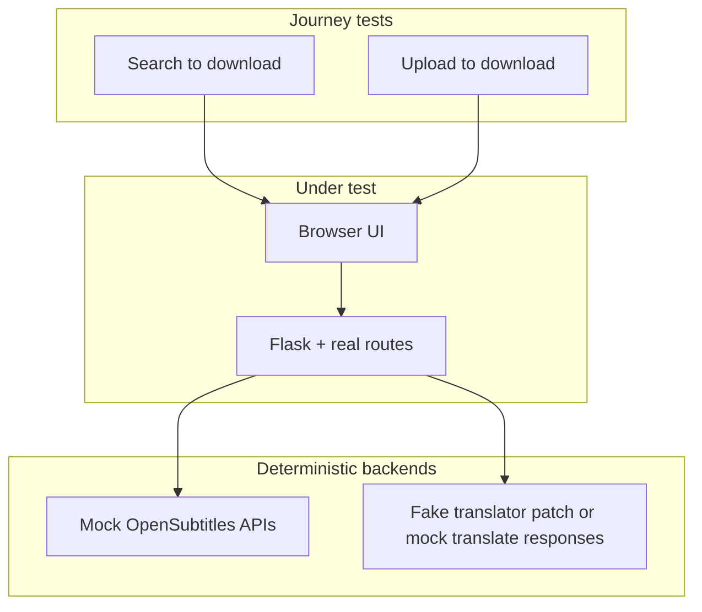

# UI automated tests for subtitle-translator

## Goals (what you asked for)

- **Automate the manual regression you do today**: search a movie/show → pick a result → translate → download → **verify the subtitle output**; repeat for **meaningful setting combinations**; keep a parallel **upload file** journey that does the same through translate and download.
- **Optimize for refactors**: tests should track **user-visible behavior** and **outcomes** (dialogs, success state, downloaded file bytes/text), not implementation details (specific class names, deep DOM shape, pixel layout). When the UI is reorganized but behavior stays the same, tests should mostly keep passing.
- **Still use mocks/fakes** for OpenSubtitles (and optionally translation) so CI is fast, does not need API keys, and **does not burn OpenSubtitles rate limits**. The *behavior* under test is the app’s flow and output format, not third-party availability.

## What you have today

- **Frontend**: [index.html](index.html) + [static/js/main.js](static/js/main.js), Flask from [srt_translator/__init__.py](srt_translator/__init__.py).
- **Backend tests**: [tests/](tests/) with `test_client()` and [tests/conftest.py](tests/conftest.py) (`patch_translator` fake mapping) — good **reference** for expected translated strings when the real translate path runs with patches.
- **Dependencies**: [requirements.txt](requirements.txt) has `pytest` and `playwright`; **`pytest-playwright`**, top-level **`e2e/`** (or **`tests/e2e/`** with `collect_ignore`), and **[`pytest.ini`](pytest.ini)** with **`testpaths = tests`** are still to add.

### UI touchpoints for the two journeys

- **Search path**: suggestions (`#osQuery`, listbox), `#osSearchBtn`, results table, row selection / fetch, preview panel (`#subtitlePreviewPanel`), `#translateBtn`, `#translateConfirmDialog`, progress, `#downloadSection` / `#downloadBtn`.
- **Upload path**: `#sourceUpload`, `#srtFile` / `#fileDisplay`, same language controls, confirm, translate, download.
- **Settings to vary** (parametrize, not every Cartesian product unless cheap): `#translateToOtherLang`, `#sourceLanguage`, `#targetLanguage` (including pinyin options), `#dualLanguage` (inside advanced details), `#osAnyLanguage` on search path.

## Testing philosophy — fewer breaks on refactor

1. **Assert behavior, not structure**: e.g. “confirm dialog shows chosen file and languages”, “download starts”, “saved file is valid SRT (or ASS) and contains expected cue text”, not “this `div` has these five nested classes”.
2. **Prefer Playwright locators tied to accessibility**: `getByRole`, `getByLabel`, `getByText` for stable visible copy (button names, dialog title, table captions). Reserve **IDs** or **`data-testid`** for generated content (e.g. **one row in results table**) where roles alone are not unique — add minimal `data-testid` on rows or cells **only** if needed.
3. **Single source of truth for expected translation strings**: reuse the same fake translator mapping as [tests/conftest.py](tests/conftest.py) when using a **live server + `patch_translator`**, so API tests and E2E agree on expected lines in the downloaded file.
4. **Download verification**: use Playwright’s **download** event (`expect_download`), read the file from the suggested path (or stream), then assert with plain-text checks (subtitle index lines, known translated snippet). Optionally reuse small **fixture .srt** files under `tests/e2e/fixtures/` for upload tests.

This is different from a large suite of isolated widget tests; the **primary suite** is a small set of **journey tests** + **parametrized variants**.

## Recommended architecture



1. **Live Flask** on ephemeral port (`TESTING=True`).
2. **Fake data strategy** (pick one coherent approach per journey):
   - **Preferred for “real stack” behavior**: **monkeypatch** OpenSubtitles client (or register test doubles) on the Flask app **before** the server thread starts, so JSON shapes and SSE match production code paths; keep **`patch_translator`** (or equivalent) for translate. Then E2E asserts true integration (parse, progress, download URL).
   - **Alternative**: `page.route()` for `/api/opensubtitles/*` and translate/download if patching is heavy — still assert final download content matches what you fulfilled.

3. **Playwright** `base_url` = live server so `/api` is same-origin.

## Pytest defaults — E2E skipped for `python -m pytest -q`

E2E tests are slow (browser startup, full journeys). **They must not run on the default command** `python -m pytest -q` so day-to-day API/unit runs stay fast.

**Recommended layout (simplest mental model):**

- Put browser tests under a **top-level** [`e2e/`](e2e/) directory (sibling of [`tests/`](tests/), not inside it).
- Add [`pytest.ini`](pytest.ini) with:

```ini
[pytest]
testpaths = tests
markers =
    e2e: browser end-to-end tests (slow; run explicitly)
```

With **`testpaths = tests`**, a bare `pytest` or `python -m pytest -q` **only** collects [`tests/`](tests/). Nothing under `e2e/` runs unless you pass that path.

**Commands:**

| Intent | Command |
| ------ | ------- |
| Default (fast — no browser) | `python -m pytest -q` |
| E2E only | `python -m pytest -q e2e` |

Still mark E2E modules/classes with `@pytest.mark.e2e` for clarity in reports and for optional filtering.

**Alternative** if E2E must live under **`tests/e2e/`**:

- In [`tests/conftest.py`](tests/conftest.py), set `collect_ignore = ["e2e"]` so recursive collection of `tests/` skips the `e2e` package. Run E2E with **`python -m pytest -q tests/e2e`** (explicit path). Confirm behavior once in your pytest version.

**Avoid relying on** `addopts = -m "not e2e"` **alone** without understanding CLI merging: if `addopts` includes `-m "not e2e"` and you also pass `-m e2e`, pytest combines marker expressions with **AND**, so you can collect **zero** tests. Fixing that requires **`--override-ini="addopts="`** (or similar) on the E2E invocation. The **`testpaths` + separate `e2e/`** approach avoids that pitfall.

## API surface (for mocks or patches)

See prior list in codebase: suggestions, search, status, fetch, preview, fetched download, task, translate, SSE progress, `/api/download/<file_id>`.

## OpenSubtitles API load and rate limits

OpenSubtitles enforces **rate limits**; suggestions, search, fetch, preview, and download each consume quota. Automated suites that hit the **real** API on every run or on every parametrized case will eventually **429** or get blocked.

**Default (CI and normal E2E):** Keep **all** `/api/opensubtitles/*` traffic **mocked or monkeypatched** so the search journey exercises your app code without calling upstream. Same as already stated in **Goals** and **Recommended architecture**.

**If you add optional “live OpenSubtitles” tests** (manual smoke, rare nightly, local debugging), design them to **minimize calls**:

1. **Narrow queries**: Prefer titles that return **small, stable result sets** (e.g. distinctive short titles or specific well-known releases) so you need **fewer** search pages and less suggestion churn. Avoid generic strings that fan out into many suggestion round-trips or huge tables.
2. **Fewer round-trips**: **One** successful search → **one** row selection → **one** fetch per session where possible; **share fixtures** across parametrized “settings” tests (same subtitle file, vary only translate options) instead of re-searching for every parameter.
3. **Pagination**: Do not drive **Next/Previous** against the live API in automated tests unless essential; default page size already favors smaller pages — still, **mock** pagination E2E.
4. **Suggestions**: Typing in `#osQuery` triggers **`/api/opensubtitles/suggestions`**; against live API, prefer **minimal keystrokes**, a **fixed query**, or **mock suggestions** while testing UI. Do not fuzz-type long strings in loops.
5. **“Search all languages”**: Real API use with `#osAnyLanguage` can increase payload and follow-up work; keep that path **mocked** in E2E, or isolate a **single** live test if required.
6. **Upload journey**: Favor **`test_journey_upload`** and parametrized **translate/output** settings **without** OpenSubtitles for matrix coverage — **zero** OS calls for those cases.
7. **Gating**: Use a pytest marker e.g. `@pytest.mark.live_opensubtitles` (or `env RUN_LIVE_OS=1`) so live tests **never** run in default or CI jobs; document a **single** command for maintainers and add **cooldown / serial** execution if you run them in one job (`pytest -n 1` for that marker).

**Summary:** Mocked OS for **default E2E**; live OS only **opt-in**, **low volume**, **narrow queries**, **no gratuitous pagination or suggestion spam**.

## Implementation outline (when executing)

1. Add **`pytest-playwright`**, pin versions, `playwright install chromium` (or full for local).
2. Add **[`pytest.ini`](pytest.ini)** with **`testpaths = tests`**, register **`e2e`** marker, so **`python -m pytest -q`** never collects the browser suite (see **Pytest defaults** above). Place E2E under top-level **`e2e/`** or use **`collect_ignore`** if using **`tests/e2e/`**.
3. **`e2e/conftest.py`** (or **`tests/e2e/conftest.py`** if using nested layout): live server; fixtures for **minimal fake OpenSubtitles** responses; apply **`patch_translator`** on the app when using the real translate route.
4. **`e2e/test_journey_search.py`**: parametrized — search → result → confirm → translate → download → assert file content.
5. **`e2e/test_journey_upload.py`**: upload fixture `.srt`, same assertions.
6. **Optional smoke** in `e2e/`: minimal load/toggle test.
7. **CI**: run **`python -m pytest -q e2e`** (if top-level `e2e/`) after `playwright install --with-deps`; **do not** enable live OpenSubtitles in CI unless using a dedicated low-frequency job with secrets and the **OpenSubtitles API load** practices above.

## Files you would touch

- **New**: `e2e/conftest.py`, `e2e/test_journey_search.py`, `e2e/test_journey_upload.py`, `e2e/fixtures/*.srt` (minimal cues) — **or** the same under `tests/e2e/` plus `collect_ignore` in [`tests/conftest.py`](tests/conftest.py)
- **New**: [`pytest.ini`](pytest.ini) (`testpaths`, markers)
- **Optional**: `requirements-dev.txt`, `.github/workflows/*.yml`
- **App**: only if you add **`data-testid`** on result rows (or similar) because `getByRole('row')` + text is insufficient after UI changes.

## Out of scope

- Replacing API tests — E2E complements [tests/test_translate_and_download.py](tests/test_translate_and_download.py) etc.; keep fast unit/API coverage for edge cases.
- **Unbounded** live OpenSubtitles in CI — if a nightly or manual job hits the real API, it should stay **opt-in**, **rate-aware**, and follow **OpenSubtitles API load and rate limits** above (narrow queries, minimal calls, no parallel hammering).
