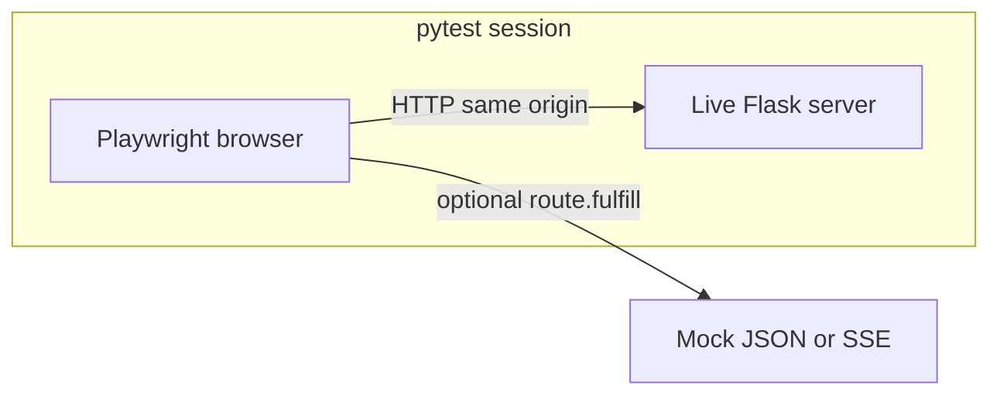

# UI automated tests for subtitle-translator

## What you have today

- **Frontend**: [index.html](index.html) + [static/js/main.js](static/js/main.js), served by Flask from [srt_translator/**init**.py](srt_translator/__init__.py) (`/` → `index.html`, `/api` → blueprint).
- **Backend tests**: [tests/](tests/) use pytest and Flask’s `test_client()` ([tests/conftest.py](tests/conftest.py)) — these exercise HTTP APIs, not the browser DOM or real user flows.

True **UI automation** means driving a real browser against a running app. The most natural fit for this repo is **Playwright + pytest** (`pytest-playwright`): same language as the backend, solid Windows support, and built-in **request interception** for stable tests.

Alternatives (for awareness):

| Approach                        | When to use                                                                            |
| ------------------------------- | -------------------------------------------------------------------------------------- |
| **Playwright + pytest**         | Default choice here: one stack, CI-friendly, mocks external APIs easily.               |
| **Cypress / Playwright (Node)** | If you prefer JS tooling and a separate `package.json`; duplicates runner from pytest. |
| **Selenium**                    | Possible but more boilerplate; no strong reason over Playwright.                       |

## Recommended architecture

1. **Session fixture**: Start Flask with `create_app()`, `TESTING=True`, on an **ephemeral port** (avoid clashing with a dev server on 5000) using `werkzeug.serving.make_server` in a **daemon thread** (or use a small helper package like `pytest-flask` only for its `live_server` if you prefer not to hand-roll threading).
2. **Playwright**: `browser` / `page` fixtures from `pytest-playwright`; `base_url` or explicit `page.goto(live_server_url)` so `getApiBase()` in [static/js/main.js](static/js/main.js) resolves to **same host/port** as the page (empty string path — already the normal case when UI and API share one origin).
3. **Selectors**: Prefer stable `#translationForm`, `#osSearchBtn`, `#sourceUpload`, etc. (already present). Add `data-testid` only where IDs are missing or ambiguous.

## Handling flaky externals (important)

The UI calls `/api/opensubtitles/*`, `/api/translate`, **EventSource** for `/api/translate/progress/...`, and download URLs ([main.js](static/js/main.js) around the `fetch` / `EventSource` usage). Full E2E against real OpenSubtitles + Google Translate will be **slow, credential-dependent, and brittle**.

Two patterns (can combine):

- **A — Playwright `page.route()`**: Fulfill JSON for search/fetch/status and translate endpoints; for SSE, fulfill with `text/event-stream` bodies or skip progress UI and only assert POST/redirect behavior — whatever matches the scenario.
- **B — Test-only Flask wiring**: Start the live server with monkeypatched services (same idea as [tests/conftest.py](tests/conftest.py) `patch_translator`) so the **real** routes run but backends are fake. The browser still does real HTTP + SSE against your app.

**A** is usually simpler for “click search → table appears” without running OpenSubtitles code paths. **B** is better when you want to regression-test **server + client integration** (real JSON shapes, real SSE framing).

## Concrete setup steps (after you leave plan mode)

1. Add dev dependencies, e.g. `pytest-playwright` (pins `playwright`); keep versions in [requirements.txt](requirements.txt) or a `requirements-dev.txt`.
2. Run once: `playwright install` (or `playwright install chromium` to save CI time).
3. Add `pytest.ini` markers if you split tests: e.g. `@pytest.mark.e2e` and optionally `@pytest.mark.slow` for tests that hit real APIs.
4. Create `tests/e2e/` (or `ui_tests/`) with:
  - `conftest.py`: live-server fixture + `base_url` for Playwright.
  - First smoke test: `page.goto("/")`, assert heading and that `#translationForm` is visible; toggle `#sourceUpload` / `#sourceSearch` and assert `#uploadPanel` / `#searchPanel` visibility (behavior already in [index.html](index.html)).
5. **CI** (e.g. GitHub Actions): Python setup, `pip install -r requirements-dev.txt`, `playwright install --with-deps chromium`, then `pytest tests/e2e -m e2e` (or your chosen path).

## Example scenarios worth automating (prioritized)

1. **Smoke**: load home, switch subtitle source radio, language dropdowns present.
2. **Upload path**: `set_input_files` on `#srtFile`, assert `#fileDisplay` text changes (no real translate needed if you mock `/api/translate` or stop before submit).
3. **Search path**: mock `POST /api/opensubtitles/search` → assert table rows / status text; optional pagination clicks on `#osPageNext` with mocked page metadata.

## Files you would touch

- New: `tests/e2e/conftest.py`, `tests/e2e/test_*.py`
- Optional: `requirements-dev.txt`, `pytest.ini`, CI workflow under `.github/workflows/`
- No change strictly required to application code unless you add `data-testid` for clearer selectors.

## Out of scope for classic “UI E2E”

- **Pure JS unit tests** (Vitest/Jest) for `main.js` would require build tooling or ESM harness; not necessary if E2E covers critical flows.
- **Accessibility**: Playwright can assert roles/labels; you already have some `aria-live` / `role="radiogroup"` in [index.html](index.html).

